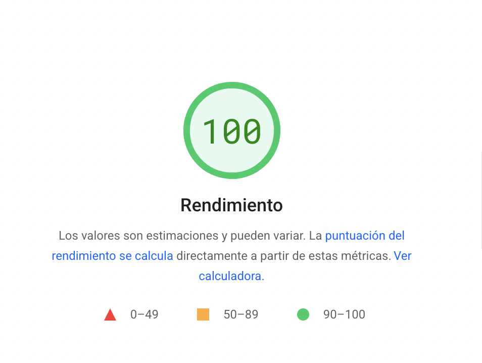
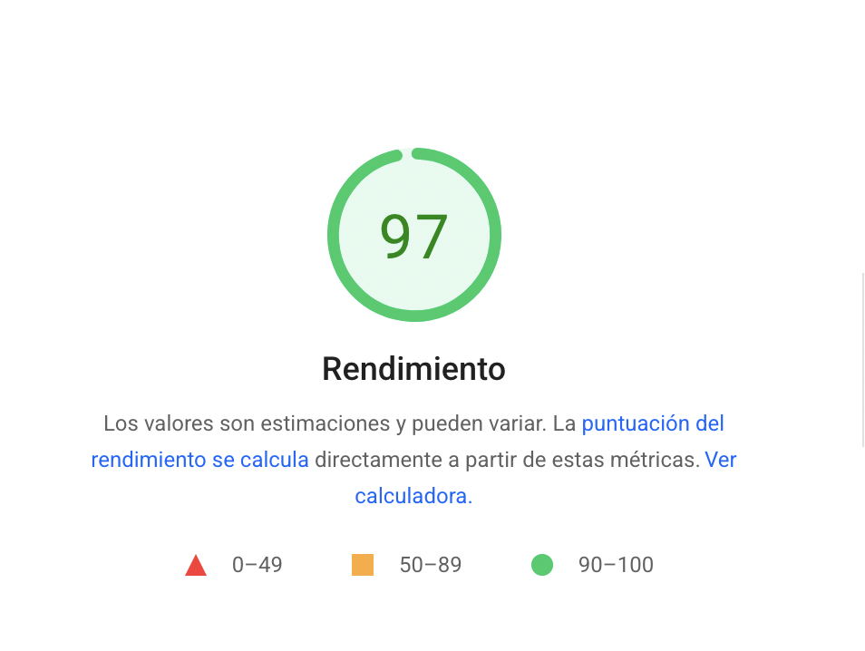

# jaime.gomezobregon.com

He aquí el código fuente y los contenidos completos de [mi sitio web personal](https://jaime.gomezobregon.com). Lo inicié en el verano de 2006, entonces como un blog, y en 2020 lo reconstruí a medida —conservando todos sus contenidos— con énfasis en **el minimalismo y la eficacia**.

Mi objetivo es proporcionarme el sistema de gestión de contenidos (CMS) que exactamente necesito, al tiempo que proporcionar al lector una experiencia de usuario óptima y _humana_.

Colateralmente, esto gusta a las máquinas también, pues [PageSpeed Insights](https://pagespeed.web.dev) otorga una puntuación excelente:

| En escritorio                                | En dispositivos móviles                    |
| -------------------------------------------- | ------------------------------------------ |
|  |  |

# Funcionalidades

Muchos sistemas de gestión de contenidos buscan ofrecer toneladas de funcionalidades ([_feature creep_](https://en.wikipedia.org/wiki/Feature_creep)). Con este proyecto pretendo justo lo contrario: la ascética belleza de que no sobre nada.

Esto es lo único que necesito y, por ende, lo único que he programado:

1. **Entradas y páginas**. Las entradas se caracterizan por una fecha de publicación, y equivalen a los artículos de un blog. Las páginas, en cambio, proporcionan contenido atemporal.

1. **Ordenamiento flexible de entradas**. La portada del sitio presenta el índice de artículos en el mismo orden en que aparecen en [`index.json`](/httpdocs/index.json), lo que permite mostrar las entradas en un orden diferente al cronológico y ordenarlas con flexibilidad.

1. **Soporte para entradas programadas**. Simplemente definiendo una fecha futura de publicación en la propiedad `date_published` de la entrada en [`index.json`](/httpdocs/index.json). El artículo no aparecerá en la portada hasta dicha fecha. Véase [#8](/../../issues/8) para los detalles.

1. **Entradas destacadas**. Puedes destacar artículos en la portada sin más que añadir `Destacado` a la propiedad `tags`. Más información en [#7](/../../issues/7).

1. **Sin _cookies_ de seguimiento**. Y, por tanto, sin el molesto aviso de _cookies_.

1. **Soporte para póster en redes sociales**. Es posible incorporar a cada entrada una imagen `poster.png` que será servida y utilizada al compartir la entrada en redes como X, LinkedIn… Como en [este ejemplo](https://x.com/JaimeObregon/status/1433371404230082560).

1. **Maquetación para impresora**. He incorporado una hoja de estilos específica para mejorar la estética de quien decida imprimir un contenido. La reflexión está en [#3](/../../issues/3).

1. **Notas al pie**. Son muy útiles para proporcionar referencias o añadir aclaraciones marginales sin entorpecer el desarrollo narrativo del texto. Véase [esta entrada con notas al pie](/httpdocs/posts/del-limitado-acceso-a-las-resoluciones-judiciales) para un ejemplo de uso.

1. **Doble título**. Puedes mostrar un titular breve en la portada y otro más expresivo ya en la entrada. Esto es frecuente en sitios periodísticos, por ejemplo.

1. **Tuits incrustados**. El marcado mínimo para incrustar un tuit es el siguiente, donde el valor del atributo `data-id` es el `id` del mensaje a incrustar:

   ```html
   <blockquote class="tweet" data-id="1395067736531865604"></blockquote>
   ```

   No obstante, es recomendable utilizar el marcado completo tal como se indica en el siguiente ejemplo, que ha sido confeccionado a partir del _snippet_ que genera X cuando se pulsa en <i>Embed post</i>. [He aquí un ejemplo](https://jaime.gomezobregon.com/del-limitado-acceso-a-las-resoluciones-judiciales) de tuit incrustado conforme a esta recomendación.

   <details>
       <summary>Ejemplo de marcado completo</summary>

   ```html
   <blockquote class="tweet" data-id="1395067736531865604">
     <p>
       Soy fan de simplificar la tecnología todo lo posible. También de la
       austeridad en el ornato. Con este espíritu el año pasado renové mi blog
       (iniciado en 2006).<br />
       <br />
       Bastaron solo 233 líneas de código y una pequeña hoja de estilos. El
       rendimiento es máximo.<br />
       <br />
       🔗 <a href="https://t.co/Z83n8yLxqo">https://t.co/Z83n8yLxqo</a>
       <a href="https://t.co/WOjSZVVQts">pic.twitter.com/WOjSZVVQts</a>
     </p>
     <footer>
       — Jaime Gómez-Obregón (<code>@JaimeObregon</code>), el
       <a href="https://x.com/JaimeObregon/status/1395067736531865604">
         19 de mayo de 2021 </a
       >.
     </footer>
   </blockquote>
   ```

   </details>

1. **Directorio de descargas temporales**. Es posible utilizar [`/tmp`](/httpdocs/tmp) como sustituto doméstico de plataformas como WeTransfer a la hora de subir y compartir temporalmente ficheros. Los contenidos de este directorio desaparecerán automáticamente en el siguiente despliegue. Para hacer un fichero permanente, añádase al repositorio.

1. **Detalles ortotipográficos**. Como las [letras capitulares](/httpdocs/assets/initials), la estilización de los [números romanos en versalitas](https://www.fundeu.es/consulta/siglo-21-o-siglo-xxi-29522/) o la prevención de saltos de línea inmediátamente antes o después de las [rayas](https://www.fundeu.es/escribireninternet/la-raya-tambien-exist/) (_em dash_ o «—», no confundir con el guion o «-») que marcan un inciso. Estas dos últimas, recomendación tanto de tipógrafos como de la Real Academia Española.

1. **Secciones enlazables**. Cualquier `<h2>` dentro de una entrada es interpretado como un encabezado de sección y es automáticamente convertido en un enlace. Esto es práctico para facilitar el acceso a secciones específicas de entradas extensas.

# Sobre las florituras tipográficas

La deliberada austeridad del diseño que persigo tiene una excepción consciente en la filigrana del separador temático (`<hr>`) y las floridas letras miniadas (también llamadas _letras capituales_ o _iniciales_).

Para estas últimas he preferido las diseñadas por [William Morris](https://en.wikipedia.org/wiki/William_Morris) en el s. xɪx, que he encontrado en [Openclipart](https://openclipart.org/search/?query=William+Morris+Letter) bajo licencia de dominio público. Por una cuestión de rendimiento en el sitio las incrusto como elementos SVG. He optimizado el trazado vectorial de cada una de estas 26 letras capitulares, que comparto en [`/httpdocs/assets/initials`](/httpdocs/assets/initials) para quien las desee.

# Modo de empleo

Instala las dependencias con `yarn` o `npm install`.

Arranca el servidor de desarrollo con `yarn serve` o `npm run serve`. El repositorio incluye en [`.vscode/`](.vscode/) una tarea configurada para Visual Studio Code.

Como en un blog, este proyecto habilita dos tipos de contenido: las **entradas** (en [`/posts`](/httpdocs/posts)), que se caracterizan por tener una fecha y formar parte de una cronología, y las **páginas** (en [`/pages`](/httpdocs/pages)), que no tienen esa temporalidad.

Para añadir nuevo contenido…:

1. Crea un subdirectorio en [`/posts`](/httpdocs/posts) o [`/pages`](/httpdocs/pages) y carga dentro un fichero `index.html` con el marcado HTML, así como cualquiera otros recursos que el artículo necesite cargar.

2. Añade el contenido recién creado a [`index.json`](/httpdocs/index.json). Será una entrada si proporcionas la propiedad `date_published`, y una página si no.

El fichero `index.json` es el _feed_ del blog en formato [JSON Feed](https://jsonfeed.org). La mayoría de los sitios generan este _feed_ a partir de los contenidos; aquí lo hacemos justo al revés.

# Estructura mínima de un artículo

Cada artículo —sea entrada o página— ha de tener, como mínimo, un fichero `index.html` con el contenido principal. No obstante ahí también puedes cargar imágenes, recursos multimedia, hojas de estilos y cualquier otra cosa que el artículo requiera.

Es requisito que este fichero `index.html` tenga un elemento `<h1>` con el título, que así puede ser diferente del consignado en [`index.json`](/httpdocs/posts/index.json).

Opcionalmente es posible proporcionar en el directorio de cada artículo también un fichero `poster.png` que se mostrará al compartir el artículo en redes sociales.

# Tecnología

Es una aplicación estática (_frontend_) JavaScript, desarrollada íntegramente sobre estándares web, sin _frameworks_ ni librerías externas.

Este proyecto utiliza exclusivamente estándares web: HTML, CSS y JavaScript. No hay ningún lenguaje de _scripting_ en el lado del servidor, ni se requiere de una base de datos.

Es conveniente un servidor web capaz de interpretar las reglas de reescritura del fichero [`.htaccess`](/httpdocs/.htaccess). Por ejemplo, Apache o Nginx.

# Despliegue

He configurado el panel de control Plesk de mi alojamiento para que clone y despliegue el proyecto con cada _push_ a `master`.

# El manifiesto: un tributo a las cosas sencillas

En 2003 presenté mi Proyecto Fin de Carrera, sobre **sistemas de gestión de contenidos** (CMS, por sus siglas en inglés). Desde entonces y hasta 2020 he trabajado con cientos de implantaciones de decenas de CMS diferentes. En este proyecto he querido dotarme del _anti-CMS_.

**El abuso de la publicidad invasiva, el SEO agresivo y la economía de la atención están destruyendo la web**: los autores ya no escriben artículos para sus lectores, sino para _generar tráfico_. Y los técnicos ya no escriben código para los navegadores de sus usuarios, sino para _posicionar arriba en buscadores_. Es [una perversión de los principios](https://neustadt.fr/essays/against-a-user-hostile-web).

Yo aquí me apeo de ese mundo. Considero que hace falta **un reinicio, una inversión radical de valores**: volver a poner a la humanidad y la sensibilidad en el centro y regresar a la esencia desnuda de las cosas.

- **Menos es más.** Este sitio no tiene un buscador porque no hace falta: el navegador del usuario ya tiene uno. Y en la web hay más. Tampoco necesita este proyecto de una base de datos. No es necesaria. Aquí no hay política de privacidad porque no se recaba ningún dato personal, ni siquiera la dirección IP del visitante. También he erradicado todo ornamento irrelevante. ¡Viva la bella sobriedad, la sublime austeridad en el ornato!

- **Excelencia técnica.** Este sitio web utiliza exclusivamente tecnologías modernas y estándar: HTML5, CSS3 y ES6 (JavaScript). Aquí escribo marcado semántico, código válido conforme a las especificaciones, y proporciono metadatos a los contenidos. No utilizo clases (`class`) ni identificadores (`id`) irrelevantes: es el sueño del tecnomarxista actual: un documento sin clases.

- **Muerte a las _cookies_ prescindibles.** La ley europea obliga a informar al usuario antes de instalar _cookies_ de seguimiento en su navegador, y eso está bien. Sin embargo, la gran mayoría de los sitios web **en realidad no necesitarían instalar ninguna cookie**. Pero lo excepcional se ha convertido en norma y ahora hasta los sitios más anodinos de la web requieren docenas de _cookies_ y **molestan al usuario** pidiendo su consentimiento para instalarlas. Este es mi sitio web, y no instalará ninguna cookie en tu navegador. Por lo tanto, tampoco te molestará pidiéndote consentimiento.

- **No analizo el tráfico del sitio**. Esta es otra moderna ansiedad: la de contar _las visitas_ y trazar vistosas gráficas de tráfico en línea. En mi blog no escribo para batir ningún récord de visitas. La mayoría de las veces estas métricas solo alimentan vanidades, y usar Google Analytics refuerza la posición monopolística de Google.

- **Más rápido que la luz**. [PageSpeed Insights](https://pagespeed.web.dev) le otorga a este blog una puntuación de entre 99 y 100 puntos sobre cien. Pero mi objetivo con este proyecto no ha sido ganar muchos puntos ahí, sino ofrecer a los usuarios la mejor experiencia de usuario posible.

- **Contenido para personas, no para los buscadores**. Es frecuente, sobre todo en los medios de comunicación en línea, la escritura para los _bots_ y el SEO. Eligen las palabras, el marcado y hasta la extensión del contenido pensando en algoritmos y el tráfico. Esto relega al lector y degrada su experiencia, al tiempo que rebaja la calidad del contenido del autor. Yo escribo para quien quiera leer, y lo hago ciñéndome al estándar técnico de la web: marcado HTML5 semántico y válido conforme la especificación del W3C.

- **Simple de mantener**. La locura de los CMS no tiene límites: actualizaciones, parches de seguridad, _plugins_ y plantillas, _sitemaps_, metaetiquetas, cachés... En este sitio doy la espalda a todo eso. Es un simple conjunto de ficheros estáticos y menos de 500 líneas de JavaScript. No hay ninguna compleja arquitectura de software que mantener. Y es sano que así sea. Cuando quiero escribir un artículo, simplemente creo un fichero y lo publico con un <em>commit</em> y un <em>push</em>. Y ya.

- **Con un licenciamiento claro y permisivo**. Publico tanto el código del sitio como sus contenidos bajo licencias abiertas. Estando ambas cosas complatemente expuestas en internet, no tiene mucho sentido hacerlo de otro modo.

# Licencia

Salvo donde se exprese lo contrario, los contenidos de mi sitio web están publicados bajo licencia [CC BY-SA 4.0](https://creativecommons.org/licenses/by-sa/4.0/deed.es): puedes reutilizarlos citando mi nombre completo en calidad de autor, enlazando a la versión original en [jaime.gomezobregon.com](https://jaime.gomezobregon.com) y solo si tu obra se publica bajo esta misma licencia abierta.

Por favor, [contáctame](https://x.com/jaimeobregon) antes de reutilizar o republicar mi contenido bajo otras condiciones.

El código fuente de este proyecto [está disponible en GitHub](https://github.com/jaimeobregon/jaime.gomezobregon.com) bajo licencia [AGPL 3.0](/LICENSE). Puedes reutilizarlo atendiendo lo que establece la licencia.
